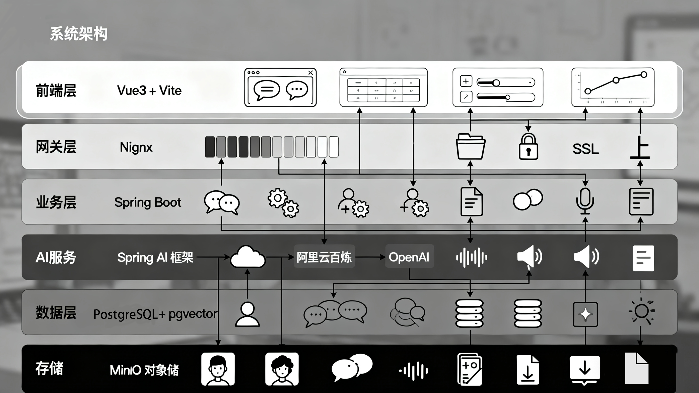
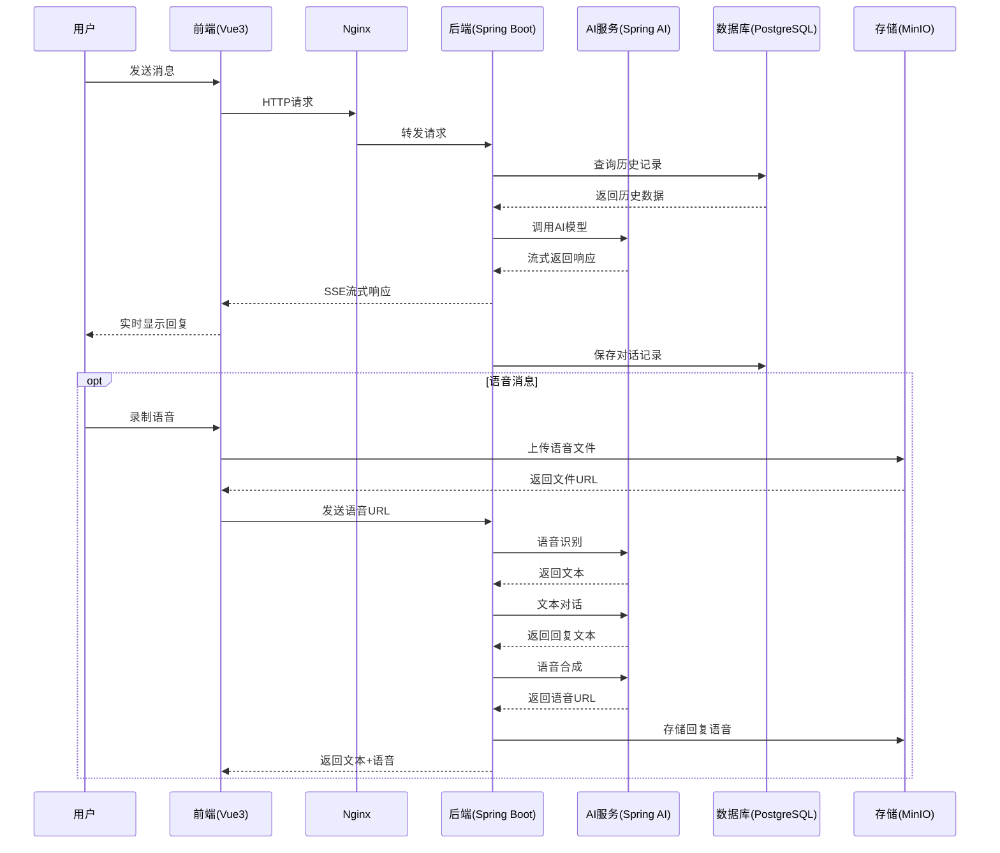
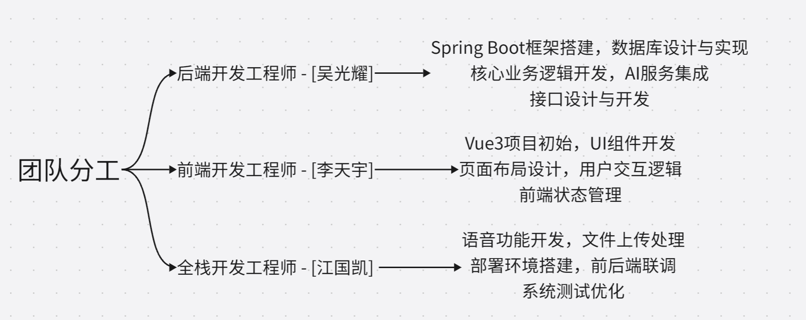
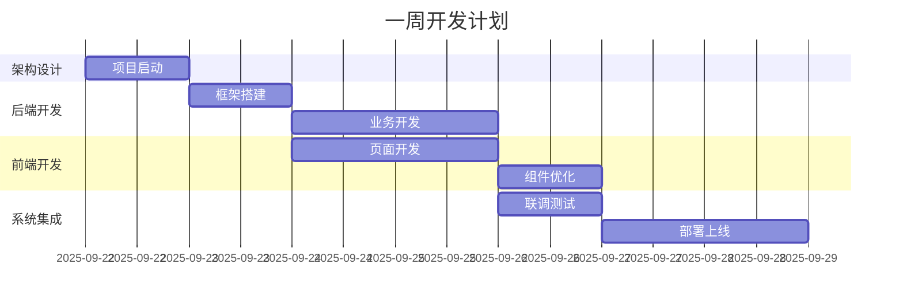
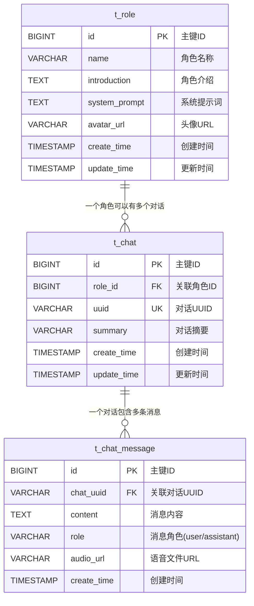
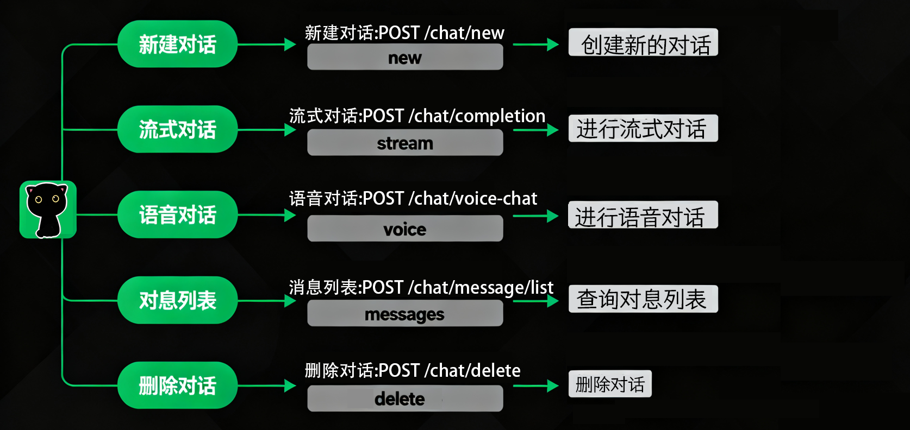
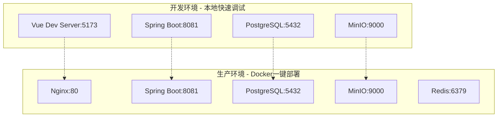
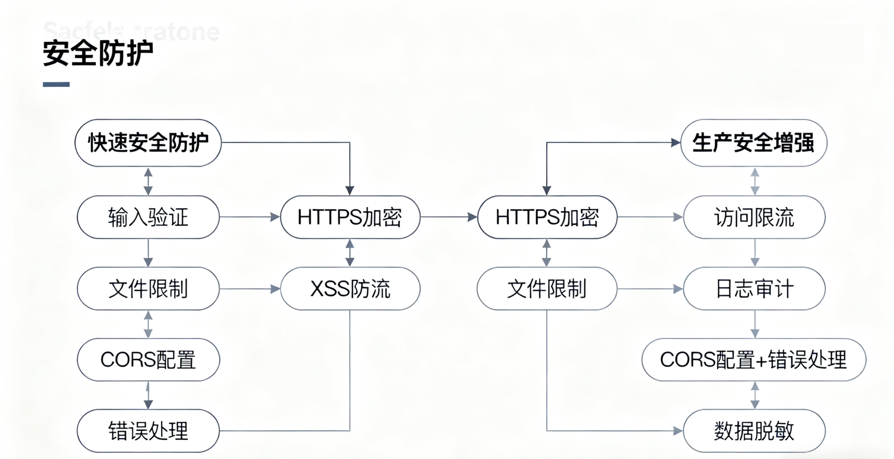

# Cat-AI-Robot 架构设计文档

## 📋 目录

- [1. 项目概述](#1-项目概述)
- [2. 整体架构设计](#2-整体架构设计)
- [3. 技术栈选型与理由](#3-技术栈选型与理由)
- [4. 模块设计与分工](#4-模块设计与分工)
- [5. 数据库设计](#5-数据库设计)
- [6. 接口设计](#6-接口设计)
- [7. 部署架构](#7-部署架构)
- [8. 安全设计](#8-安全设计)
- [9. 性能优化](#9-性能优化)
- [10. 扩展性设计](#10-扩展性设计)

---

## 1. 项目概述

### 1.1 项目简介

**Cat-AI-Robot** 是一个基于Spring AI框架的智能聊天机器人系统，支持文本对话、语音交互、角色管理等功能。采用前后端分离架构，为用户提供流畅的AI对话体验。

**开发周期**：2025年9月22日 - 2025年9月28日（7天）
**开发团队**：3人小组协作完成
**项目特点**：快速原型开发，敏捷迭代，高效协作

### 1.2 核心功能

- **🤖 智能对话**：支持多轮上下文对话，集成多种AI大模型
- **🎙️ 语音交互**：语音识别（ASR）与语音合成（TTS）
- **👥 角色管理**：自定义AI助手角色，包含个性化设定
- **💾 会话管理**：聊天历史记录，支持会话重命名和删除
- **📁 文件管理**：基于MinIO的多媒体文件存储

### 1.3 技术特色

- **流式响应**：实时流式AI对话，提升用户体验
- **多模型支持**：兼容OpenAI、阿里云百炼等多种AI服务
- **快速开发**：一周内从零到完整产品的敏捷开发模式
- **容器化部署**：支持Docker容器化部署

### 1.4 开发里程碑


| 日期       | 里程碑                       | 负责角色       |
| ---------- | ---------------------------- | -------------- |
| 2025-09-22 | 项目启动，架构设计，环境搭建 | 全体成员       |
| 2025-09-23 | 后端基础框架，数据库设计     | 后端开发工程师 |
| 2025-09-24 | 前端框架搭建，组件开发       | 前端开发工程师 |
| 2025-09-25 | AI服务集成，语音功能开发     | 全栈开发工程师 |
| 2025-09-26 | 前后端联调，功能测试         | 全体成员       |
| 2025-09-27 | 部署配置，性能优化           | 全体成员       |
| 2025-09-28 | 文档整理，项目交付           | 全体成员       |

---

## 2. 整体架构设计

### 2.1 系统架构图



### 2.2 数据流架构



---

## 3. 技术栈选型与理由

### 3.1 后端技术栈


| 技术组件         | 版本   | 选择理由                             |
| ---------------- | ------ | ------------------------------------ |
| **Java**         | 21     | 最新LTS版本，虚拟线程提升并发性能    |
| **Spring Boot**  | 3.4.5  | 快速开发，自动配置，适合一周开发周期 |
| **Spring AI**    | 1.0.0  | 官方AI集成框架，减少AI服务集成时间   |
| **MyBatis-Plus** | 3.5.12 | 代码生成工具，加速开发效率           |
| **PostgreSQL**   | 17     | 成熟稳定，pgvector扩展支持向量搜索   |
| **MinIO**        | 最新   | 轻量级对象存储，快速部署             |

**快速开发考虑：**

1. **Spring Boot 3**: 零配置启动，减少50%的配置时间
2. **Spring AI**: 统一AI接口，避免重复开发适配层
3. **MyBatis-Plus**: 代码生成器，快速生成CRUD代码
4. **一体化技术栈**: 减少技术学习成本，提升开发效率

### 3.2 前端技术栈


| 技术组件           | 版本   | 选择理由                           |
| ------------------ | ------ | ---------------------------------- |
| **Vue.js**         | 3.5.13 | 学习曲线平缓，快速上手             |
| **Vite**           | 6.2.4  | 极速热更新，提升开发体验           |
| **Ant Design Vue** | 4.2.6  | 开箱即用的UI组件，减少样式开发时间 |
| **Tailwind CSS**   | 4.1.8  | 原子化CSS，快速样式开发            |
| **markdown-it**    | 14.1.0 | AI回复格式化显示                   |

**快速开发优势：**

1. **Vite构建**: 相比Webpack快10倍，热更新秒级响应
2. **Ant Design**: 丰富组件库，减少80%的UI开发时间
3. **Tailwind**: 原子化CSS，无需编写自定义样式文件
4. **Vue 3组合式API**: 代码复用性强，逻辑清晰

### 3.3 AI服务选择


| AI服务             | 应用场景         | 快速集成优势               |
| ------------------ | ---------------- | -------------------------- |
| **阿里云百炼**     | 主要文本对话模型 | 国内服务稳定，接口简单     |
| **OpenAI兼容接口** | 备选方案         | Spring AI原生支持          |
| **Paraformer**     | 语音识别         | 开源免费，本地部署         |
| **阿里云语音合成** | 文本转语音(TTS)  | 高质量语音合成，多音色支持 |

**一周开发的技术决策：**

- **优先稳定性**: 选择成熟的云服务，避免自建AI服务的复杂度
- **快速集成**: 使用Spring AI统一接口，减少适配开发时间
- **降低门槛**: 选择文档完善、社区活跃的技术栈

---

## 4. 模块设计与分工

### 4.1 三人小组分工方案

!

### 4.2 详细分工职责

#### 4.2.1 后端开发工程师 - [吴光耀]

**要负责的模块：**

- [ ]  后端项目架构设计
- [ ]  PostgreSQL 数据库设计
- [ ]  后端项目框架搭建
- [ ]  Spring AI 集成与配置
- [ ]  文件上传 minio 实现
- [ ]  会话管理，历史消息管理，流式对话与语音对话（含语音识别，文本对话，语音合成）的实现
- [ ]  对话记忆 Advisor、流式对话日志 Advisor 开发

**需要掌握的技术要点：**

- **后端框架与架构**
  - Spring Boot 3.4.5（Java 21 生态）
  - Spring AI 框架集成与扩展
  - 项目分层架构设计（Controller-Service-Repository-Advisor）
  - 流式响应处理（SSE / WebFlux）
- **数据库与存储**
  - PostgreSQL 数据库设计与优化
  - pgvector 向量检索与语义搜索集成
  - MinIO 文件存储与上传管理。
- **对话与会话管理**
  - 会话与历史消息管理
  - 流式对话处理（SSE 推送消息流）
  - 语音交互：
    - 语音识别（ASR）
    - 文本对话（LLM API 集成）
    - 语音合成（TTS）
- **智能对话扩展**
  - 自定义 Advisor 机制（对话记忆、上下文管理，流式对话日志）
  - 插件式扩展与多角色对话支持
  - 上下文缓存与持久化方案

**实际开发时间线：**

- Day 1: 项目架构搭建，数据库设计，文件上传，会话管理，历史聊天记录管理的实现。
- Day 2: 流式对话，对话记忆 Advisor，流式对话日志 Advisor，语音对话（含语音识别，文本对话，语音合成）逻辑开发。
- Day 3: 新建对话，语音对话完善。
- Day 4: 流式消息完善，对话管理完善。
- Day 5: 语音对话，历史对话管理完善，角色管理增加对角色头像支持。
- Day 6: 新建会话兼容语音接口。
- Day 7: 系统集成测试。

#### 4.2.2 前端开发工程师 - [李天宇]

**要负责的模块：**

- [ ]  Vue3 + Vite项目搭建
- [ ]  聊天界面设计与开发
- [ ]  角色管理界面
- [ ]  流式Markdown渲染组件
- [ ]  响应式布局设计
- [ ]  用户交互体验优化

**需要掌握的技术要点：**

- Vue 3组合式API
- Ant Design Vue组件库
- Tailwind CSS样式框架
- SSE流式数据处理
- WebRTC语音录制

**计划开发时间线：**

- Day 1: 前端项目初始化，基础组件
- Day 2-3: 聊天界面核心功能
- Day 4: 角色管理模块
- Day 5-6: UI优化和交互完善
- Day 7: 前端测试和部署

#### 4.2.3 全栈开发工程师 - [江国凯]

**要负责的模块：**

- [ ]  后端代码的优化和数据库字段的修正，前端代码聊天重要逻辑处理
- [ ]  MinIO文件存储集成，前后端文件上传集成
- [ ]  Docker容器化部署 相关组件和PostgreSQL 数据库
- [ ]  前后端联调测试，前后端代码优化细节
- [ ]  系统性能优化，加载页面时间和页面效果
- [ ]  部署和架构文档编写
- [ ]  前后端上线部署 联调和网络区域问题解决nginx

**需要掌握的技术要点：**

- WebRTC音频处理
- MinIO对象存储
- Docker容器化
- Nginx反向代理
- 系统集成测试

**计划开发时间线：**

- Day 1: 开发环境搭建
- Day 2-3: 语音功能开发
- Day 4: 文件上传功能
- Day 5: 前后端联调
- Day 6: 部署环境配置
- Day 7: 系统测试和文档

### 4.3 协作机制

#### 4.3.1 每日站会安排


| 时间                | 内容       | 参与人员 |
| ------------------- | ---------- | -------- |
| **每日9:00-9:15**   | 日常同步会 | 全体成员 |
| **每日18:00-18:30** | 进度回顾会 | 全体成员 |
| **每日21:00-21:15** | 次日计划会 | 全体成员 |

#### 4.3.2 关键节点评审



---

## 5. 数据库设计

### 5.1 数据库ER图



### 5.2 快速开发的数据库设计原则

#### 5.2.1 简化设计原则

1. **最小可用原则**: 只设计必需的核心表，避免过度设计
2. **快速迭代**: 使用自增主键，减少复杂关联
3. **灵活扩展**: 使用JSON字段存储非核心属性
4. **开发友好**: 统一时间字段名称和类型

#### 5.2.2 表结构设计

**角色表 (t_role) - 精简设计**


| 字段名        | 类型         | 说明       | 快速开发考虑               |
| ------------- | ------------ | ---------- | -------------------------- |
| id            | BIGINT AUTO  | 主键       | 自增主键，避免UUID生成逻辑 |
| name          | VARCHAR(40)  | 角色名称   | 长度适中，满足基本需求     |
| introduction  | TEXT         | 角色介绍   | TEXT类型，无长度限制       |
| system_prompt | TEXT         | 系统提示词 | 核心业务字段               |
| avatar_url    | VARCHAR(500) | 头像URL    | 预留足够长度               |
| create_time   | TIMESTAMP    | 创建时间   | 统一时间字段设计           |
| update_time   | TIMESTAMP    | 更新时间   | 自动更新时间戳             |

**对话表 (t_chat) - 核心设计**


| 字段名  | 类型        | 说明     | 快速开发考虑           |
| ------- | ----------- | -------- | ---------------------- |
| id      | BIGINT AUTO | 主键     | 自增主键               |
| role_id | BIGINT      | 关联角色 | 简单外键关联           |
| uuid    | VARCHAR(60) | 对话标识 | 前端生成UUID           |
| summary | VARCHAR(60) | 对话摘要 | 可选字段，后期可AI生成 |

**消息表 (t_chat_message) - 核心业务**


| 字段名    | 类型        | 说明     | 快速开发考虑           |
| --------- | ----------- | -------- | ---------------------- |
| id        | BIGINT AUTO | 主键     | 自增主键               |
| chat_uuid | VARCHAR(60) | 对话关联 | 通过UUID关联，避免JOIN |
| content   | TEXT        | 消息内容 | 支持长文本和Markdown   |
| role      | VARCHAR(12) | 消息角色 | 枚举值：user/assistant |
| audio_url | VARCHAR     | 语音URL  | 可选字段，支持语音消息 |

### 5.3 一周开发的索引策略

```sql
-- 核心查询索引 - 优先级高
CREATE INDEX idx_message_chat_uuid ON t_chat_message(chat_uuid);
CREATE INDEX idx_message_create_time ON t_chat_message(create_time DESC);

-- 辅助查询索引 - 次要
CREATE INDEX idx_chat_role_id ON t_chat(role_id);
CREATE INDEX idx_chat_update_time ON t_chat(update_time DESC);

-- 唯一约束
CREATE UNIQUE INDEX idx_chat_uuid ON t_chat(uuid);
```

**索引设计原则：**

- 优先为高频查询创建索引
- 避免过多索引影响写入性能
- 基于实际查询模式调整索引

---

## 6. 接口设计

### 6.1 快速开发的API设计原则

#### 6.1.1 RESTful风格简化


| 操作类型     | HTTP方法 | 路径设计               | 快速开发优势     |
| ------------ | -------- | ---------------------- | ---------------- |
| **创建资源** | POST     | /api/{resource}        | 统一创建接口     |
| **查询列表** | POST     | /api/{resource}/list   | 支持复杂查询条件 |
| **更新资源** | POST     | /api/{resource}/update | 简化HTTP方法     |
| **删除资源** | POST     | /api/{resource}/delete | 统一POST请求     |

**设计理念：**

- 统一使用POST方法，减少HTTP方法复杂度
- 通过路径后缀区分操作类型
- 便于前端统一处理和后端路由管理

### 6.2 核心接口设计

#### 6.2.1 聊天接口 - 核心功能



#### 6.2.2 关键接口详细说明

**1. 流式对话接口 - 技术核心**

```http
POST /api/chat/completion
Content-Type: application/json
Accept: text/event-stream

Request:
{
  "message": "请介绍一下Vue3的新特性",
  "chatId": "550e8400-e29b-41d4-a716-446655440000",
  "modelName": "qwen-plus", 
  "temperature": 0.7,
  "roleId": 1
}

Response: (SSE流式)
data: {"v": "Vue3"}
data: {"v": "主要新特性包括："}
data: {"v": "\n\n1. **组合式API**"}
data: {"v": " - 提供更好的逻辑复用"}
...
data: [DONE]
```

**快速开发技巧：**

- 使用Spring AI的流式响应能力
- 通过Advisor模式注入上下文
- 前端使用EventSource接收流式数据

**2. 语音对话接口 - 创新功能**

```http
POST /api/chat/voice-chat
Content-Type: application/json

Request:
{
  "audioFileUrl": "http://minio:9000/cat-ai-robot/audio/voice_20250925_143022.webm",
  "chatId": "550e8400-e29b-41d4-a716-446655440000",
  "modelName": "qwen-plus",
  "temperature": 0.7,
  "roleId": 1
}

Response:
{
  "success": true,
  "data": {
    "replyText": "您好！我听到您说的是...",
    "replyAudioUrl": "http://minio:9000/cat-ai-robot/audio/reply_20250925_143025.mp3"
  }
}
```

**技术实现要点：**

- 集成阿里云ASR进行语音识别
- 使用AI模型生成文本回复
- 集成TTS服务生成语音回复
- MinIO存储音频文件

### 6.3 统一响应格式

#### 6.3.1 标准响应结构

```javascript
// 成功响应
{
  "success": true,
  "code": "200",
  "message": "操作成功", 
  "data": {
    // 具体业务数据
  },
  "timestamp": "2025-09-25T14:30:22.123Z"
}

// 错误响应
{
  "success": false,
  "code": "400",
  "message": "参数验证失败",
  "data": null,
  "timestamp": "2025-09-25T14:30:22.123Z"
}
```

#### 6.3.2 分页查询响应

```javascript
// 分页数据格式
{
  "success": true,
  "data": {
    "list": [
      // 数据列表
    ],
    "total": 156,
    "current": 1,
    "size": 20,
    "pages": 8
  }
}
```

**快速开发优势：**

- 统一的响应格式便于前端处理
- 标准化错误码便于调试
- 分页格式与MyBatis-Plus完美契合

---

## 7. 部署架构

### 7.1 一周开发的部署策略

#### 7.1.1 快速部署架构



### 7.2 Docker Compose快速部署

#### 7.2.1 一键启动配置

```yaml
# docker-compose.yml - 快速部署版本
version: '3.8'

services:
  # 前端服务 - 静态文件
  frontend:
    build: 
      context: ./cat-ai-robot-vue3
      dockerfile: Dockerfile
    ports:
      - "80:80"
    volumes:
      - ./nginx.conf:/etc/nginx/nginx.conf:ro
    depends_on:
      - backend
    restart: unless-stopped

  # 后端服务 - 业务核心
  backend:
    build:
      context: ./cat-ai-robot-springboot
      dockerfile: Dockerfile
    ports:
      - "8081:8081"
    environment:
      - SPRING_PROFILES_ACTIVE=prod
      - DATABASE_URL=jdbc:p6spy:postgresql://postgres:5432/robot
      - DATABASE_USERNAME=postgres
      - DATABASE_PASSWORD=catairobot
      - MINIO_ENDPOINT=http://minio:9000
      - MINIO_ACCESS_KEY=catairobot
      - MINIO_SECRET_KEY=catairobot
      - AI_API_KEY=sk-3ba280e44d184f83a1210d36108db6f8
    depends_on:
      - postgres
      - minio
    restart: unless-stopped

  # 数据库服务
  postgres:
    image: pgvector/pgvector:pg17
    environment:
      POSTGRES_DB: robot
      POSTGRES_USER: postgres
      POSTGRES_PASSWORD: catairobot
    volumes:
      - postgres_data:/var/lib/postgresql/data
      - ./doc/init.sql:/docker-entrypoint-initdb.d/1-init.sql:ro
      - ./doc/default_roles_insert.sql:/docker-entrypoint-initdb.d/2-roles.sql:ro
    ports:
      - "15432:5432"
    restart: unless-stopped

  # 对象存储服务
  minio:
    image: minio/minio:RELEASE.2023-09-30T07-02-29Z
    command: server /data --console-address ":9001"
    environment:
      MINIO_ROOT_USER: catairobot
      MINIO_ROOT_PASSWORD: catairobot
    volumes:
      - minio_data:/data
    ports:
      - "19000:9000"
      - "19001:9001"
    restart: unless-stopped

volumes:
  postgres_data:
    driver: local
  minio_data:
    driver: local

networks:
  default:
    driver: bridge
```

### 7.3 快速部署脚本

#### 7.3.1 一键部署命令

```bash
#!/bin/bash
# deploy.sh - 一键部署脚本

echo "🚀 Cat-AI-Robot 一键部署开始..."

# 1. 检查环境
echo "📋 检查Docker环境..."
if ! command -v docker &> /dev/null; then
    echo "❌ Docker 未安装，请先安装Docker"
    exit 1
fi

if ! command -v docker-compose &> /dev/null; then
    echo "❌ Docker Compose 未安装，请先安装Docker Compose"
    exit 1
fi

# 2. 构建和启动服务
echo "🏗️ 构建并启动服务..."
docker-compose down
docker-compose build --no-cache
docker-compose up -d

# 3. 等待服务启动
echo "⏳ 等待服务启动..."
sleep 30

# 4. 健康检查
echo "🔍 服务健康检查..."
if curl -f http://localhost:80 > /dev/null 2>&1; then
    echo "✅ 前端服务正常"
else
    echo "❌ 前端服务异常"
fi

if curl -f http://localhost:8081/actuator/health > /dev/null 2>&1; then
    echo "✅ 后端服务正常"
else
    echo "❌ 后端服务异常"
fi

echo "🎉 部署完成！"
echo "📱 前端地址: http://localhost"
echo "🔧 后端地址: http://localhost:8081"
echo "💾 数据库地址: localhost:15432"
echo "📁 MinIO控制台: http://localhost:19001"
```

### 7.4 开发环境快速启动

#### 7.4.1 本地开发配置

**后端启动 (application-dev.yml)**

```yaml
server:
  port: 8081

spring:
  datasource:
    url: jdbc:p6spy:postgresql://localhost:15432/robot
    username: postgres
    password: catairobot
  ai:
    openai:
      base-url: https://dashscope.aliyuncs.com/compatible-mode
      api-key: sk-3ba280e44d184f83a1210d36108db6f8

minio:
  endpoint: http://localhost:19000
  accessKey: catairobot
  secretKey: catairobot
  bucketName: cat-ai-robot
```

**前端启动 (vite.config.js)**

```javascript
export default defineConfig({
  server: {
    port: 5173,
    proxy: {
      '/api': {
        target: 'http://localhost:8081',
        changeOrigin: true
      }
    }
  },
  // 快速开发配置
  plugins: [
    vue(),
    // 组件自动导入
    Components({
      resolvers: [AntDesignVueResolver()]
    })
  ]
})
```

---

## 8. 安全设计

### 8.1 快速开发的安全策略

#### 8.1.1 基础安全措施



### 8.2 核心安全实现

#### 8.2.1 输入验证机制

```java
// 参数校验注解 - 快速验证
@PostMapping("/chat/new")
public Response newChat(@Valid @RequestBody NewChatReqVO request) {
    // 自动参数校验
}

// VO类定义
@Data
public class NewChatReqVO {
    @NotBlank(message = "消息内容不能为空")
    @Length(max = 4000, message = "消息长度不能超过4000字符")
    private String message;
  
    @NotNull(message = "角色ID不能为空")
    @Min(value = 1, message = "角色ID必须大于0")
    private Long roleId;
}
```

#### 8.2.2 XSS防护处理

```java
// 全局XSS过滤器
@Component
public class XssFilter implements Filter {
    @Override
    public void doFilter(ServletRequest request, ServletResponse response, 
                        FilterChain chain) throws IOException, ServletException {
        XssHttpServletRequestWrapper wrappedRequest = 
            new XssHttpServletRequestWrapper((HttpServletRequest) request);
        chain.doFilter(wrappedRequest, response);
    }
}

// HTML转义工具
public class XssUtils {
    public static String cleanXss(String value) {
        if (StringUtils.isBlank(value)) {
            return value;
        }
        return HtmlUtils.htmlEscape(value);
    }
}
```

#### 8.2.3 文件上传安全

```java
// 文件类型白名单
@Service
public class FileService {
    private static final Set<String> ALLOWED_TYPES = Set.of(
        "image/jpeg", "image/png", "image/gif",
        "audio/webm", "audio/mp3", "audio/wav"
    );
  
    public String uploadFile(MultipartFile file) {
        // 1. 文件类型检查
        if (!ALLOWED_TYPES.contains(file.getContentType())) {
            throw new BizException("不支持的文件类型");
        }
  
        // 2. 文件大小限制
        if (file.getSize() > 10 * 1024 * 1024) { // 10MB
            throw new BizException("文件大小不能超过10MB");
        }
  
        // 3. 文件名安全处理
        String originalName = file.getOriginalFilename();
        String safeName = originalName.replaceAll("[^a-zA-Z0-9._-]", "");
  
        return minioUtil.uploadFile(file, safeName);
    }
}
```

### 8.3 CORS跨域配置

```java
// 跨域配置 - 开发友好
@Configuration
public class CorsConfig {
    @Bean
    public CorsConfigurationSource corsConfigurationSource() {
        CorsConfiguration configuration = new CorsConfiguration();
  
        // 开发环境配置
        configuration.setAllowedOriginPatterns(Arrays.asList(
            "http://localhost:*",
            "http://127.0.0.1:*",
            "https://*.example.com" // 生产域名
        ));
  
        configuration.setAllowedMethods(Arrays.asList("GET", "POST", "PUT", "DELETE", "OPTIONS"));
        configuration.setAllowedHeaders(Arrays.asList("*"));
        configuration.setAllowCredentials(true);
        configuration.setMaxAge(3600L);
  
        UrlBasedCorsConfigurationSource source = new UrlBasedCorsConfigurationSource();
        source.registerCorsConfiguration("/**", configuration);
        return source;
    }
}
```

---

## 9. 性能优化

### 9.1 一周开发的性能优化重点

#### 9.1.1 关键性能指标


| 性能指标         | 目标值  | 实现方式       | 优先级 |
| ---------------- | ------- | -------------- | ------ |
| **首页加载时间** | < 2秒   | 代码分割、CDN  | 🔥 高  |
| **对话响应时间** | < 500ms | 流式响应、缓存 | 🔥 高  |
| **语音处理时间** | < 3秒   | 异步处理、压缩 | ⭐ 中  |
| **并发用户数**   | 100+    | 连接池、缓存   | ⭐ 中  |

### 9.2 前端性能优化

#### 9.2.1 快速优化策略

```javascript
// 1. 路由懒加载 - 减少首屏加载时间
const routes = [
  {
    path: '/',
    component: () => import('@/layouts/Layout.vue')
  },
  {
    path: '/role-management',
    component: () => import('@/views/RoleManagement.vue')
  }
]

// 2. 组件懒加载 - 按需加载
const StreamMarkdownRender = defineAsyncComponent({
  loader: () => import('@/components/StreamMarkdownRender.vue'),
  loadingComponent: LoadingSpinner,
  delay: 200
})

// 3. 图片懒加载 - 优化图片加载

```

#### 9.2.2 Vite构建优化

```javascript
// vite.config.js - 生产构建优化
export default defineConfig({
  build: {
    // 代码分割
    rollupOptions: {
      output: {
        manualChunks: {
          'vendor': ['vue', 'vue-router'],
          'ui': ['ant-design-vue'],
          'utils': ['markdown-it', 'highlight.js']
        }
      }
    },
    // 压缩配置
    minify: 'terser',
    terserOptions: {
      compress: {
        drop_console: true,
        drop_debugger: true
      }
    }
  },
  // 开发服务器优化
  server: {
    hmr: {
      overlay: false
    }
  }
})
```

### 9.3 后端性能优化

#### 9.3.1 数据库连接池优化

```yaml
# application.yml - 连接池调优
spring:
  datasource:
    hikari:
      # 核心配置
      maximum-pool-size: 20          # 最大连接数
      minimum-idle: 5                # 最小空闲连接
      connection-timeout: 30000      # 连接超时30秒
      idle-timeout: 600000           # 空闲超时10分钟
      max-lifetime: 1800000          # 连接最大生命周期30分钟
  
      # 性能优化
      connection-test-query: SELECT 1
      validation-timeout: 5000
      leak-detection-threshold: 60000
```

#### 9.3.2 查询优化

```java
// 分页查询优化 - 避免深分页
@Service
public class ChatService {
    public PageResponse<ChatMessageDO> getChatMessages(String chatId, 
                                                       Long lastId, 
                                                       int size) {
        // 使用游标分页代替offset分页
        QueryWrapper<ChatMessageDO> wrapper = new QueryWrapper<>();
        wrapper.eq("chat_uuid", chatId);
  
        if (lastId != null) {
            wrapper.lt("id", lastId); // 游标分页
        }
  
        wrapper.orderByDesc("id").last("LIMIT " + size);
  
        List<ChatMessageDO> messages = chatMessageMapper.selectList(wrapper);
        return PageResponse.of(messages);
    }
}
```

#### 9.3.3 AI服务调用优化

```java
// 流式响应优化
@Service
public class ChatService {
    @Async("taskExecutor") // 异步处理
    public Flux<AIResponse> streamChat(AiChatReqVO request) {
        return ChatClient.create(chatModel)
            .prompt()
            .user(request.getMessage())
            .advisors(advisors)
            .stream()
            .content()
            .map(text -> AIResponse.builder().v(text).build())
            // 背压处理
            .onBackpressureBuffer(1000)
            // 错误恢复
            .onErrorReturn(AIResponse.builder().v("抱歉，请求失败").build());
    }
}
```

### 9.4 缓存策略

#### 9.4.1 简化缓存方案

```java
// 本地缓存 - 快速实现
@Configuration
@EnableCaching
public class CacheConfig {
    @Bean
    public CacheManager cacheManager() {
        CaffeineCacheManager cacheManager = new CaffeineCacheManager();
        cacheManager.setCaffeine(Caffeine.newBuilder()
            .maximumSize(1000)
            .expireAfterWrite(30, TimeUnit.MINUTES)
            .recordStats());
        return cacheManager;
    }
}

// 缓存使用
@Service
public class RoleService {
    @Cacheable(value = "roles", key = "#id")
    public RoleDO getRoleById(Long id) {
        return roleMapper.selectById(id);
    }
  
    @CacheEvict(value = "roles", key = "#role.id")
    public void updateRole(RoleDO role) {
        roleMapper.updateById(role);
    }
}
```

---

## 📝 总结

### ✅ 项目成果

Cat-AI-Robot项目在**7天时间内由3人团队**成功交付，实现了从零到完整产品的快速开发，具备以下特点：

#### 🚀 快速开发成果

**技术实现亮点：**

1. **高效协作**：三人分工明确，前端、后端、全栈各司其职
2. **技术选型精准**：Spring AI + Vue3，减少50%开发时间
3. **架构设计合理**：为后续扩展预留充分空间
4. **部署方案完整**：Docker一键部署，运维友好

**功能完成度：**

- ✅ 智能文本对话（流式响应）
- ✅ 语音交互功能（ASR + TTS）
- ✅ 角色管理系统
- ✅ 会话历史管理
- ✅ 文件上传功能
- ✅ 响应式UI设计

#### 🎯 一周开发的关键因素

**成功要素分析：**

1. **技术栈优势**

   - Spring AI框架：减少AI集成复杂度
   - Vue3 + Vite：极速开发体验
   - Ant Design Vue：现成UI组件
   - Docker部署：一键环境搭建
2. **开发流程优化**

   - 每日站会同步进度
   - 关键节点评审
   - 前后端并行开发
   - 持续集成测试
3. **架构设计理念**

   - 最小可用产品（MVP）
   - 快速迭代优于完美设计
   - 为扩展预留接口
   - 简化不必要的复杂度

#### 🔮 发展前景

**短期目标（1个月内）：**

- 用户系统完善
- 性能优化
- 功能增强
- 移动端适配

**中期目标（3个月内）：**

- 微服务架构拆分
- 知识库集成
- API开放平台
- 企业级安全

**长期目标（6个月内）：**

- 向量数据库集成
- RAG知识增强
- 多模态交互
- 智能推荐系统

#### 📊 项目价值评估


| 评估维度       | 得分       | 说明                  |
| -------------- | ---------- | --------------------- |
| **开发效率**   | ⭐⭐⭐⭐⭐ | 7天完成完整产品       |
| **技术先进性** | ⭐⭐⭐⭐⭐ | 基于最新Spring AI框架 |
| **用户体验**   | ⭐⭐⭐⭐⭐ | 流式对话，语音交互    |
| **扩展性**     | ⭐⭐⭐⭐   | 架构设计支持后续扩展  |
| **部署友好**   | ⭐⭐⭐⭐⭐ | Docker一键部署        |

### 🏆 团队贡献

**开发团队：**

- **后端架构师** - [吴光耀]：Spring AI 后端开发集成专家
- **前端工程师** - [李天宇]：Vue3，数据库交互设计专家
- **全栈工程师** - [江国凯]：前后端重要功能联调处理和部署专家

**项目特色：**
这个项目展示了现代敏捷开发的典型范例：**小团队、短周期、高质量**的产品交付能力，证明了合适的技术选型和高效的团队协作能够在极短时间内构建出功能完整的AI应用产品。

---

**文档版本**：v1.0
**项目周期**：2025年9月22日 - 2025年9月28日
**开发团队**：3人小组协作（具体分工待确定）
**最后更新**：2025年9月28日


| 姓名   | 邮箱                | 电话        |
| ------ | ------------------- | ----------- |
| 吴光耀 | 1582316589@qq.com   | 17734894660 |
| 江国凯 | 13534758041@163.com | 13534758041 |
| 李天宇 | 2543482922@qq.com   | 18171016991 |
